# dotfiles

FreeBSD workstation config, managed with [chezmoi](https://chezmoi.io).
Desktop is **niri** (scrolling Wayland compositor) launched from **sddm**, with
waybar, hyprlock/hypridle and awww, themed Catppuccin Mocha.

Most of this is ordinary dotfiles. The niri-under-sddm part is not: FreeBSD needs
three fixes that no guide mentions, and each one presents as an identical black
screen. They are automated here — the table below exists so that if it ever
breaks again, you recognise the symptom instead of re-debugging it from scratch.

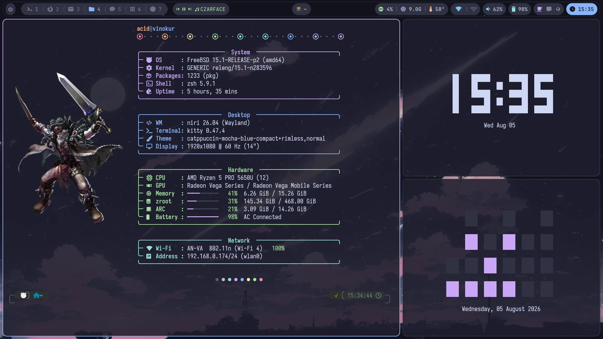

fastfetch builds the ZFS ARC and zpool bars by hand out of `sysctl
kstat.zfs.misc.arcstats`; the logo is a kitty graphics image, so it renders in
kitty and nowhere else. Alongside it, peaclock in both of its configs — digital
from `~/.config/peaclock`, binary from `~/.config/peaclock-binary`, selected with
`--config-dir`.

## The desktop

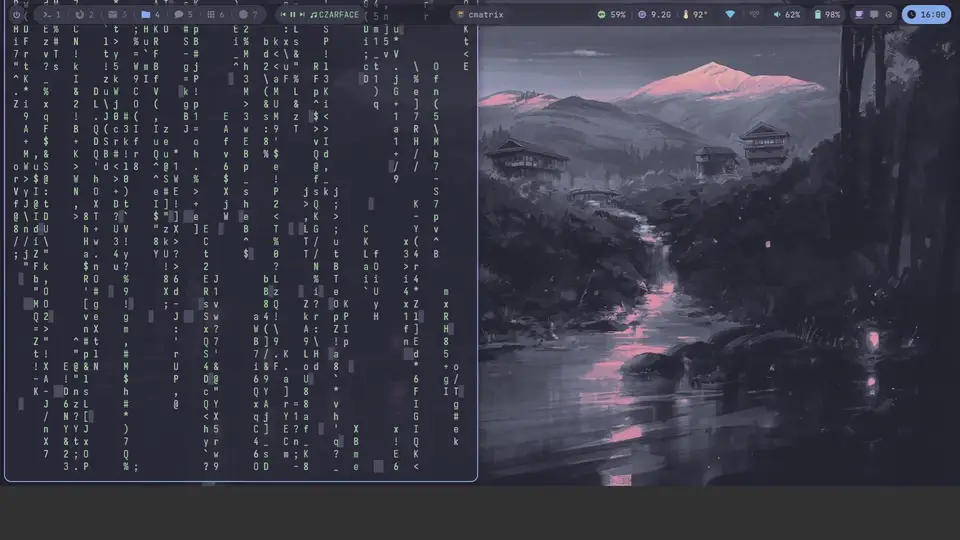

Columns scroll horizontally rather than packing into a fixed grid, so opening a
window never resizes the one you are reading. The clip runs the four column-width
presets, the tabbed-column display (IPC-only — there is no keybind for it), a
workspace switch, the overview, rofi, and a notification arriving. The full
1080p60 recording is attached to the [latest release](../../releases/latest);
only the loop above is tracked, for the same reason the wallpapers are not.

### Windows

| | |
|---|---|
| 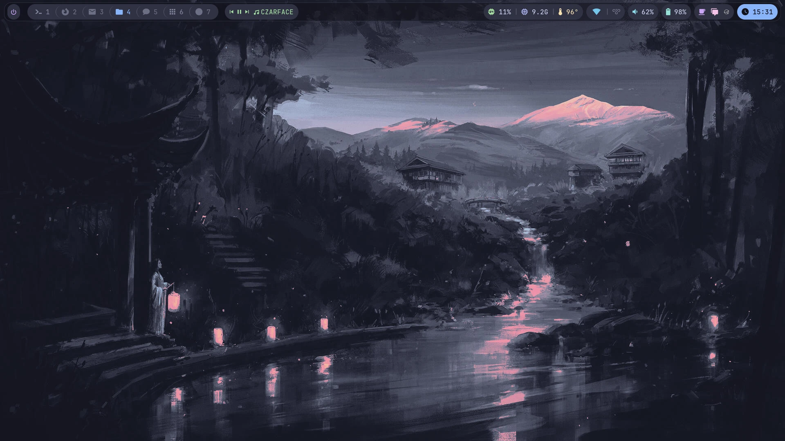<br>Bar at rest. The centre pill is blank on an empty workspace by design — `pills.css` zeroes it. | 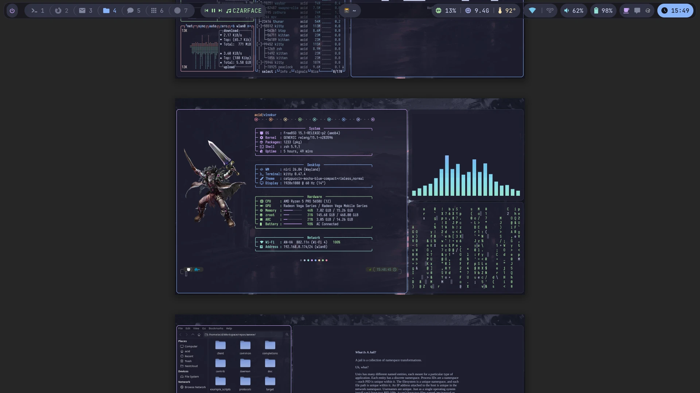<br>`Mod+O`. Workspaces stack vertically. Stock niri zoom; there is no `overview` block in the config, which is why roughly two fit on screen. |
| 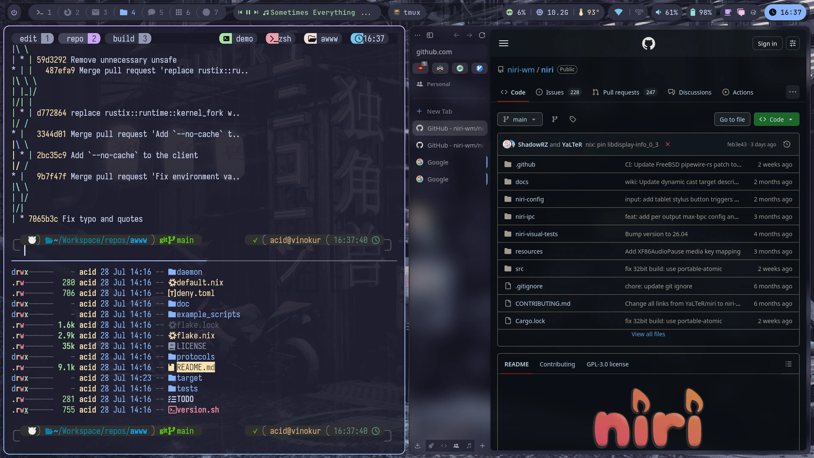<br>Zen — not in ports, built separately — beside tmux. Zen's window rule sets `xray true`, so its blur samples the *wallpaper*, not the windows behind it. | 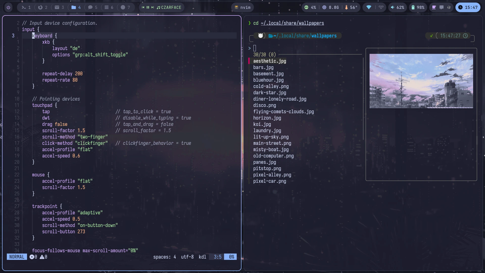<br>neovim on the niri config, and fzf's `Ctrl+T` widget previewing an image inline over the kitty graphics protocol. |
| 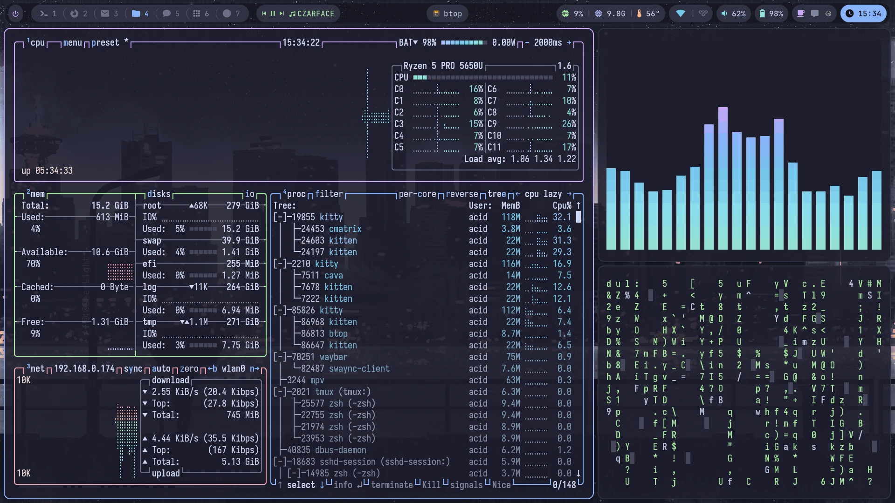<br>btop at 2/3, cava and cmatrix stacked in the remaining third. | 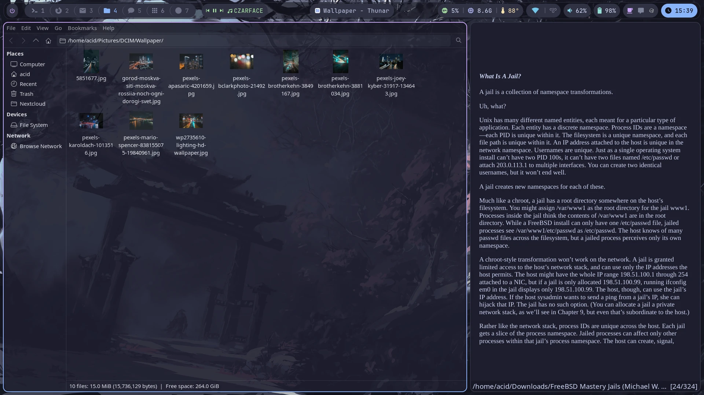<br>Thunar and zathura. `recolor` is on in `zathurarc`, which is why the page is Mocha and not white; `r` toggles it. |

### Menus, bar and notifications

| | |
|---|---|
| 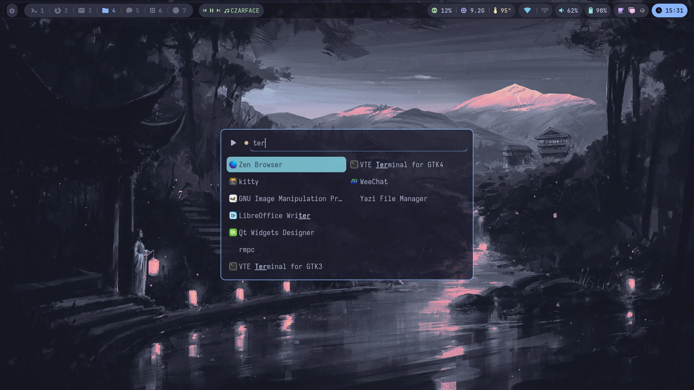<br>The drun launcher, 700px wide, two columns, filtering as you type. | 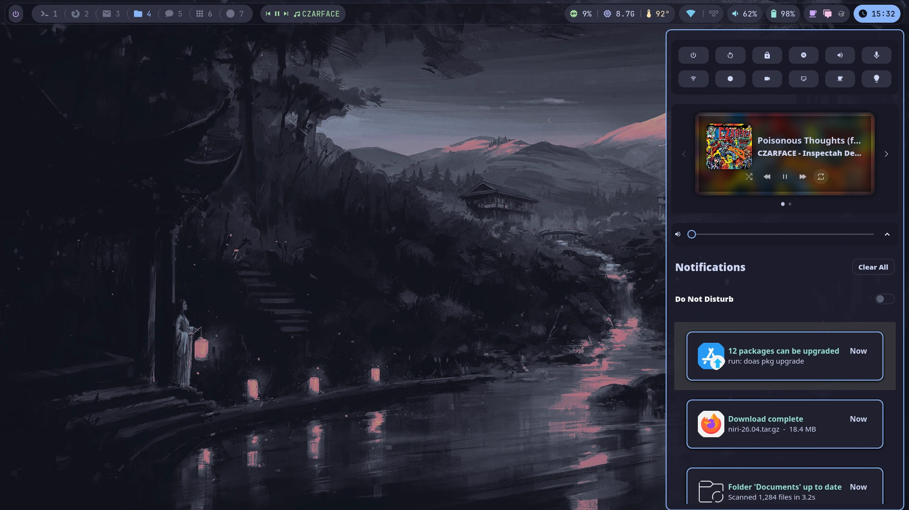<br>Control centre. The backlight widget is absent rather than broken: swaync reads `/sys/class/backlight`, which FreeBSD does not have. |
| 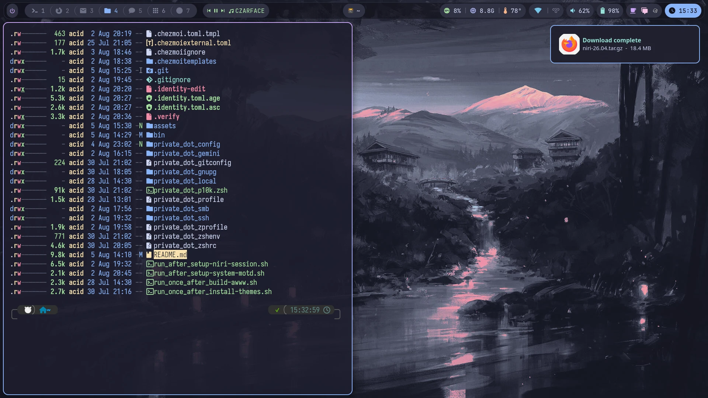<br>A toast, and the waybar swaync pill flipping to pink in the same frame. | 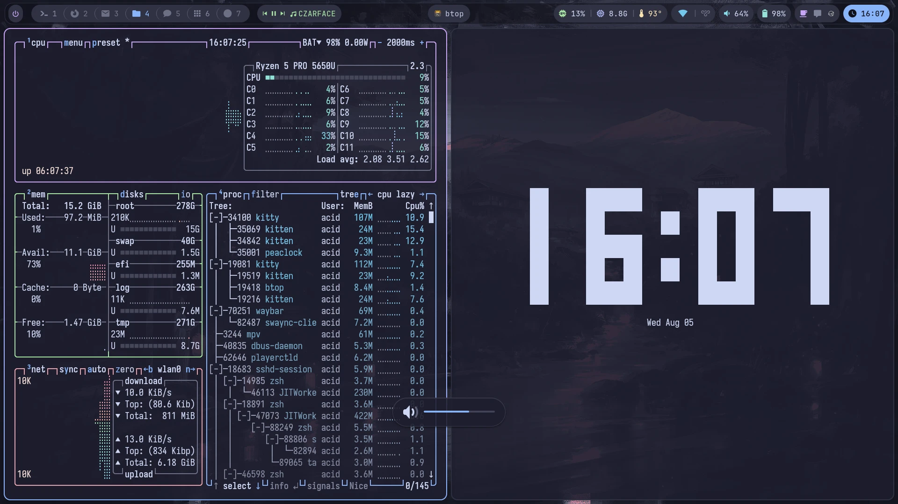<br>The volume overlay, on the `XF86Audio*` keys. Brightness goes through `backlight(8)` instead of brightnessctl, which is Linux-only. |
| 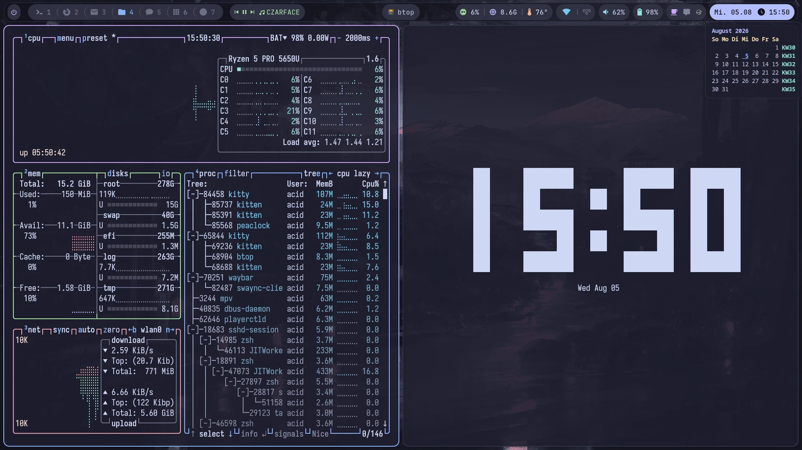<br>Hovering the clock slides the date out and opens the calendar, `de_DE` with `KW` week numbers and today underlined. | 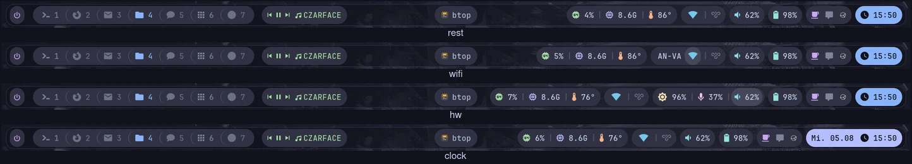<br>At rest, then the wifi, hardware and clock drawers. Right-aligned groups open *leftward* so the bar never reflows. |

### The drop-down terminal

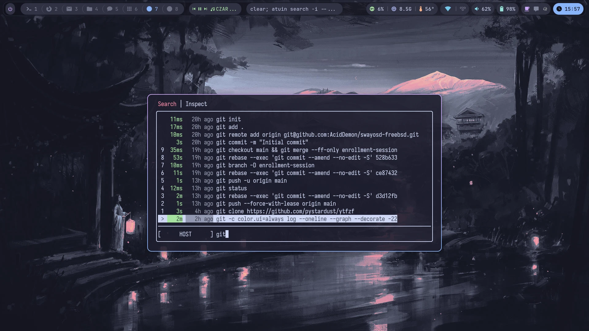

`F12`. `private_dot_config/private_niri/scripts/quake.sh` never closes the window
— it slides it to `y=-2000` and parks it on the `scratch` workspace, so the shell
and everything running in it survive. The slide is niri's own `window-movement`
animation, which is why the script's `SLIDE` constant is tuned against
`slowdown 1.8` and desyncs if you change it.

### Login and lock

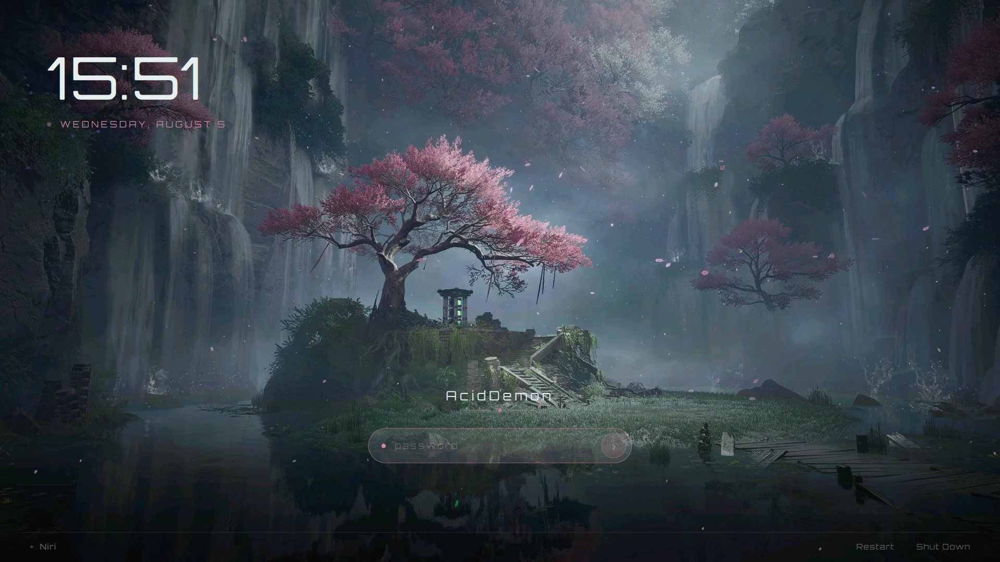

Session picker bottom-left — that is the `niri.desktop` entry the setup script
keeps repairing after every `pkg upgrade niri`.

| | |
|---|---|
| 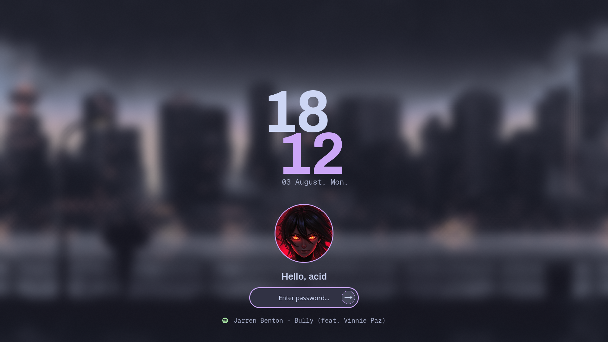<br>Static background from `~/.config/hypr/assets/lock.jpg`, blurred, plus the MPRIS line. | 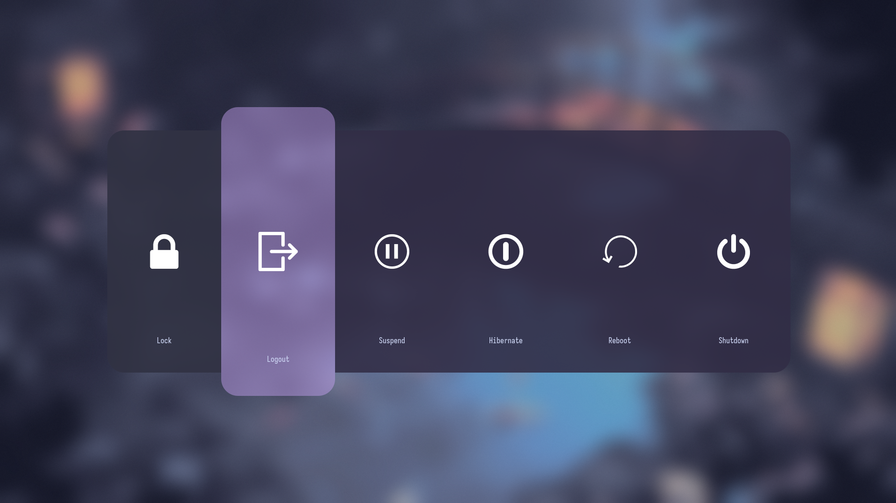<br>Six tiles, no confirmation step on any of them. `e` quits niri outright. |

## Fresh machine

```sh
pkg install -y chezmoi
chezmoi init --apply <this-repo>
```

`run_after_setup-niri-session.sh` runs automatically on every `chezmoi apply` and
is idempotent — it does nothing when everything is already correct. It will:

- install missing packages (niri, seatd, sddm, dbus, cage, waybar, python3, …)
- set `dbus_enable` / `seatd_enable` / `sddm_enable` in `rc.conf`
- add you to the `video` group (seatd refuses device access without it)
- detect your GPU and put the right DRM driver in `kld_list`
- install `/usr/local/bin/niri-session` and point the session file at it

It re-checks the session file every run on purpose: `pkg upgrade niri` overwrites
`niri.desktop` and silently reverts `Exec=`, which breaks the session with no
obvious cause.

Then reboot, pick **Niri** at the greeter, and log in.

## The three FreeBSD gotchas

| Symptom | Cause | Fixed by |
|---|---|---|
| niri panics creating its Wayland socket | sddm calls `pam_close_session` right after *starting* the session, so `pam_xdg` deletes `/var/run/xdg/$USER` while the compositor is still coming up | `XDG_RUNTIME_DIR` override to `/tmp/xdg-$USER` in `.zprofile` / `.profile` |
| waybar dead, niri logs `import environment ... exit status: 71` | sddm provides no D-Bus **session** bus | `dbus-launch` in `niri-session` |
| session dies ~1s in; niri keeps running orphaned and the greeter never comes back | seatd sends a **real-time signal** to the session leader when it takes the VT; unhandled RT signals terminate by default | RT signals ignored in `niri-session` |

Two things that actively mislead while debugging, worth knowing:

- `wayland-server` reports **every** failure opening its socket lock as
  `PermissionDenied` (`map_err(|_| PermissionDenied)`), so the real errno —
  `ENOENT` — is thrown away. `dtrace` on `openat` is what found it.
- `pam_xdg(8)` claims it does not set `XDG_RUNTIME_DIR`. It does. An
  `if [ -z "$XDG_RUNTIME_DIR" ]` guard therefore never fires; the override has
  to match on the *value*.

## Optional, not applied automatically

These grant passwordless root for specific commands, so opt in deliberately:

```sh
# ~/bin/shutdown-timer, to power off unattended after idle-lock.
# /sbin/shutdown is setuid root, group operator -- no doas rule needed.
doas pw groupmod operator -m "$(id -un)"

# ~/bin/airplane-toggle. Add AFTER any general permit line in
# /usr/local/etc/doas.conf -- doas uses the LAST matching rule.
permit nopass <user> as root cmd /sbin/ifconfig args wlan0 up
permit nopass <user> as root cmd /sbin/ifconfig args wlan0 down
```

Keep a root shell open while editing `doas.conf`; a syntax error there locks you
out of escalation entirely. Check with `doas doas -C /usr/local/etc/doas.conf`.

## Where things live

| Path | What |
|---|---|
| `bin/executable_niri-session` | session wrapper → `/usr/local/bin/niri-session` |
| `run_after_setup-niri-session.sh` | system-side setup, every apply |
| `run_once_after_build-awww.sh` | builds the awww wallpaper daemon (not in ports) |
| `run_once_after_install-themes.sh` | Colloid icons + WhiteSur cursors (583M, built not tracked) |
| `private_dot_config/private_niri/` | compositor config |
| `private_dot_zprofile`, `private_dot_profile` | the `XDG_RUNTIME_DIR` fix |

Wallpapers are deliberately **not** tracked (`.chezmoiignore`) — 32M of images do
not belong in git history. Put your own in `~/.local/share/wallpapers`.

## Identity

Addresses, real name, handles, the Syncthing device table and the private half of
`~/.ssh/config` live in two encrypted blobs at the source root: `.identity.toml.asc`
(gpg, to both YubiKey encryption subkeys) and `.identity.toml.age` (passphrase, for a
machine with no card). `.chezmoi.toml.tmpl` probes `gpg --card-status` at `chezmoi init`
and points `.identity` at whichever one this machine can open.

The blob is decrypted exactly once, by `.chezmoi.toml.tmpl` during `chezmoi init`, and
spliced into `[data]` in the generated `~/.config/chezmoi/chezmoi.toml`. Everything after
that — `apply`, `diff`, `cat`, `status` — reads plain config data and never touches the
card. Templates just say `{{ $id := . }}` and use `$id.mail.accounts` and friends.

Doing it per-template instead is what the first cut did, and it is unusable: 17 templates
means 17 `app_decipher` calls per chezmoi command, faster than pinentry can resolve them,
so the PIN prompt loops forever.

Edit with `./.identity-edit`, then re-run `chezmoi init` to reload. The script decrypts,
opens `$EDITOR`, and re-encrypts **both** blobs from the same plaintext so they cannot
drift. `./.verify` checks that.

There is deliberately no `default` fallback in those templates. With neither card nor
passphrase the apply aborts before writing anything. The GECOS field is a real name, so
a half-configured neomutt would quietly sign mail as `$(id -un)@$(hostname)` rather
than fail.

## Not in the repo

Restoring these by hand is part of setting up a new machine:

| Path | What |
|---|---|
| `~/.ssh/*_ed25519`, `*-borgbackup-ssh`, `*-restic-ssh` | the keys themselves. Only `config` is tracked |
| `~/.local/state/syncthing/` | device identity — a new `key.pem` means a new device ID and re-pairing everywhere |
| `~/.local/share/atuin/key` | history encryption key. Note `auto_sync` is on but there is no session file, so sync is **not** running — `history.db` is the only copy |
| `~/.config/gh/hosts.yml`, `~/.config/keepassxc/`, `~/.config/weechat/sec.conf`, `~/.config/syncthingtray.ini` | tokens, keys, passwords |
| the YouTube login in Zen | `yt-dlp` reads cookies straight out of Zen's profile rather than a `cookies.txt`, so there is no credential to restore — but there is also nothing to download with until you sign in. Deliberate: session cookies are bearer tokens that bypass 2FA *and* they rotate, so tracking them even encrypted would leave a fresh ciphertext in git history every refresh |
| the YubiKeys | without one, nothing above decrypts and the age passphrase is the only way in |

Syncthing device IDs and folder paths are in the identity blob under `[sync]`, so a
rebuild is a checklist rather than archaeology. All three folders are `receiveonly`.
